# Mazsola aszaló

Az Aszaló ezen specifikus változatának mintájául szolgált
Sass Bálint [Mazsola](http://corpus.nytud.hu/mazsola/) felülete.

Bővebben:

[Sass Bálint: "Mazsola" - eszköz a magyar igék bővítményszerkezetének vizsgálatára.
*In: Váradi Tamás (szerk.): Válogatás az I. Alkalmazott Nyelvészeti Doktorandusz Konferencia előadásaiból*,
MTA Nyelvtudományi Intézet, Budapest, 2009, 117-129,](http://www.nytud.hu/alknyelvdok07/proceedings07/Sass.pdf)

## Változtatások az eredeti felülethez képest

- A [28 millió szintaktikailag elemzett mondat és 500000 igei szerkezet](http://corpus.nytud.hu/isz)
   adatbázis tartalma szűrésre került:
  - A többször előforduló mondatokból csak egy példány maradt meg
  - Az igető nélküli mondatok (stem@@null) kiszűrésre kerültek
  - Az üres argumentumtövet tartalmazó mondatok kiszűrésre kerültek
  - Az argumentumok esetei normalizálásra kerültek (punktuáció, kötőjel, kisbetű-nagybetű)
  - Az üres argumentumesetek szűrésre kerültek
  - A többször előforduló eset első előfordulása maradt meg csak
  - A ritka (<5) esetek kiszűrésre kerültek
- A teljes vonzatkeret mint önálló mező helyet kapott a felületen (az üres keretek NULL értékkel vannak jelölve)
- A mondatok azonosítói megjelennek a találatok között a könnyebb visszakövethetőség miatt
- Fontosság (salience) helyett sima gyakoriságot néz a program a rangsoroláskor 

[A változtatásokat végző kód elérhető](../scripts/mazsola2tsv.py), így a szűrt adatbázis reprodukálhatóan előállítható.

## Segédlet az igei argumentumkeret-kereső használatához

A platform az igei bővítményszerkezetek kiválasztott jellemzőihez (**igető**, **argumentum**, **keret**,
**tartalmazott szó/kifejezés**) a korpuszból példákat rendel. A felületen található *rádiógomb*okkal
rendezési szempontként megadhatjuk azon jellemzőt, amely értékei alapján a keresésünk eredményét
kívánjuk csoportosítani. Az eredményeket a platform gyakoriság alapján listázza. Ezáltal áttekinthetőséget
biztosít a visszakapott példák sokasága fölött.

Az alábbiakban Aszaló általános felépítésének és működésének megértését feltételezzük.
Az általános felépítés és működés leírása [itt található](general.md).

### Lekérdezések megfogalmazása

A lekérdezések több irányból indíthatók: 

1. Megadhatunk igetövet
2. Pontosíthatjuk a lekérdezést grammatikai információk specifikálásával: megadhatjuk, hogy
    milyen bővítmények (nyelvtani eset, lexéma) forduljanak elő kötelezően a szűrésünkben
3. Lekérdezhetjük az igető minden előfordulásának argumentumkereteit, valamint magukhoz a keretekhez is kérhetünk
    azokban megjelenő igetöveket esetlegesen további megkötéseket is adva

A következőkben példákon keresztül mutatjuk be az eszköz használatát.

#### 1. Az igető megadásával induló lekérdezések

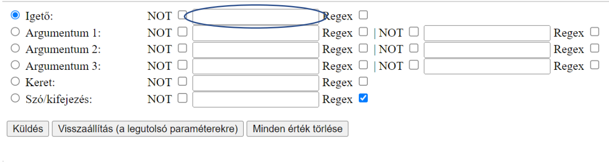

A képen jelölt mezőben adhatjuk meg azt az igetövet, amelynek a viselkedését vizsgálni szeretnénk.
Ha például beírjuk a *megsegít* lemmát a mezőbe (a legördülő sávból is kiválasztható, ha elkezdjük a gépelést),
és a **Küldés** gombra kattintunk, az eszköz listázza igető összes előfordulásához tartozó korpuszbeli példamondatot
további megszorítások nélkül egyben.

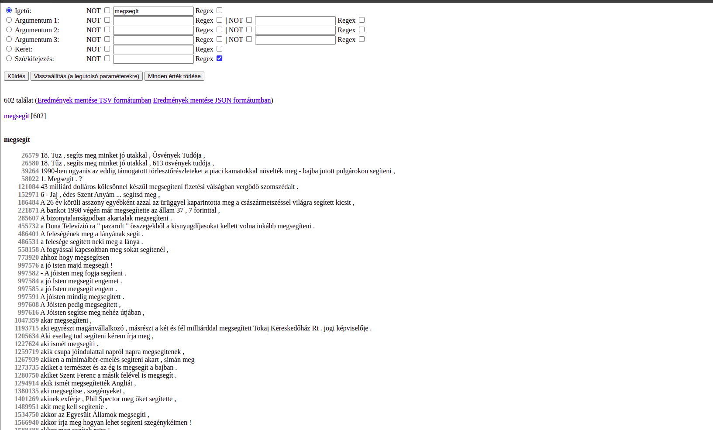

#### 2. A grammatikai információ megadásával induló lekérdezések

Amennyiben arra vagyunk kíváncsiak, hogy milyen bővítményei lehetnek az általunk vizsgált igének, 
az **Argumentum** mezőket kell használnunk. Ilyenkor csupán nyelvtani tényezők beállításával, igető megadása nélkül is
fogalmazhatunk meg lekérdezéseket. Ezek eredménye a rendezési szempont (**rádiógomb**ok) beállításától függően alakul:

- A rendezési szempont **Igető** mezőn hagyásával a megadott grammatikai tényezőkkel együtt szereplő igék korpuszbeli
   előfordulásának gyakorisága lesz. 
- A rendezési szempont **Argumentum** mezőre állításával a megadott paramétereknek
   (igető és/vagy argumentum tulajdonságok) megfelelő lexémák korpuszbeli gyakorisága lesz.

##### 2.1. Egyszerű mezők (igető) és összetett mezők (argumentumok)

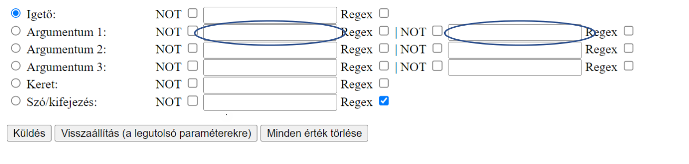

Az igető egyszerű mező, ezért egy szövegmezőből áll.
Ennek oka, hogy az igetövek további osztályozására jelenleg nincs lehetőség.
Ezzel szemben az **Argumentum** mezők összetett mezők, mivel két szővegmezőből állnak.
Míg a **bal oldali mezőkkel** konkrét bővítménytövekre lehet keresni
(pl. a *megsegít* igető esetében a *pénz* főnévi tövet megadva, l. *pénzzel megsegít*), addig a **jobb oldali mezők** az
argumentumok nyelvtani esetének megadására szolgálnak (pl. a *megsegít* esetében minden eszközhatározós 
(-*vAl* végződésű) esetben álló argumentum lekérdezhető az **INS** (instrumentum) kóddal). A grammatikai kódok 
használatát [a mellékelt táblázat](#függelék) segíti. A konkrét bővítményre való keresés mindkét mező kitöltésével
lehetséges, viszont a bővítmény töve esetrag megadása nélkül nem kérdezhető le.
Ilyen esetre a **Szó/kifejezés** mező használata javasolt.

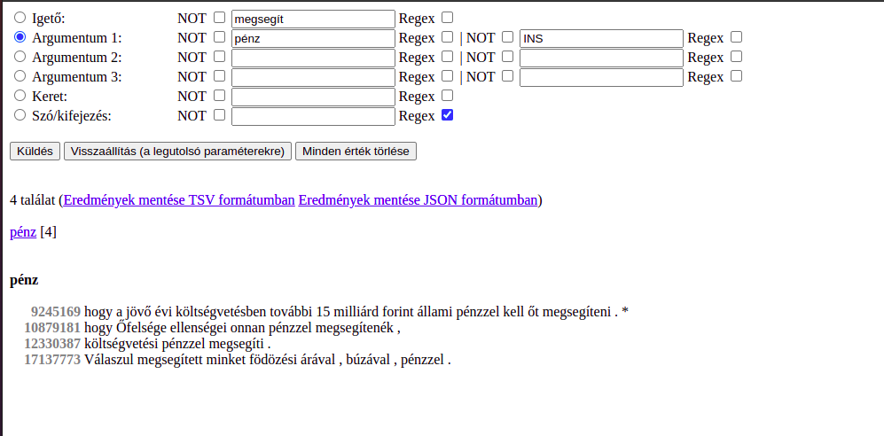

Amennyiben a lekérdezés eredményeként az adott esetalakú bővítmények lexémáinak gyakorisági eloszlását
szeretnénk kapni, a lexéma helyét üresen kell hagyni és a kért argumentum előtti **rádiógombot** kell aktiválnunk.
Ez jelzi ugyanis, hogy az adott szempont szerint kérjük összesíteni az adatokat. Látható tehát, hogy az esetalak konkrét
bővítménytől függetlenül is lekérdezhető, de természetesen együtt is megadható vele.

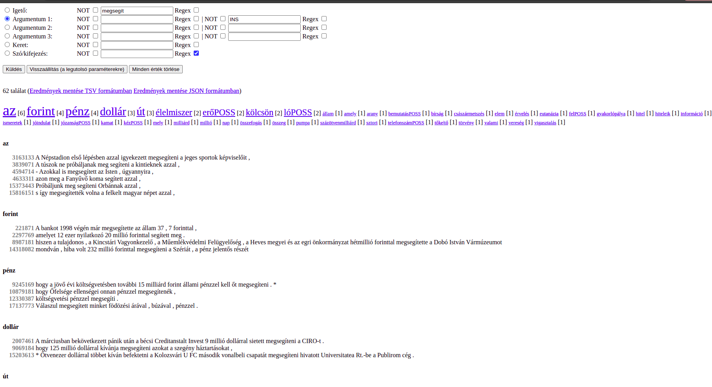

A platform lehetővé teszi azt is, hogy egyszerre több bővítmény előfordulását megkövetelő mintázatokra keressünk. Ahogyan fent láttuk, a 
**rádiógomb** aktiválásával tudjuk változtatni azt, hogy mely argumentum mező szerint rendezze a találatokat a rendszer.

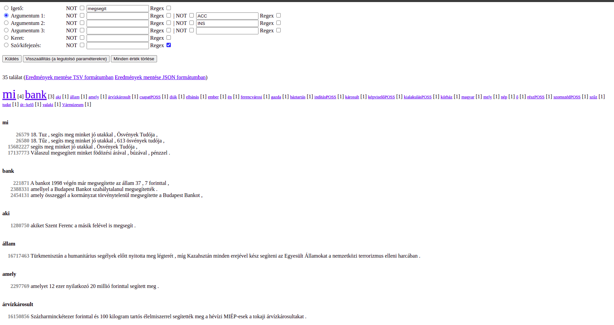

##### 2.2. Sok találat oldalakra bontva kerül megjelenítésre

Minél általánosabb séma lekérdezését fogalmazzuk meg, annál nagyobb a valószínűsége,
hogy a találati listánk hosszúsága megugrik. Az ilyen lekérdezések, ha tág feltételeket szabunk,
sok esetet kénytelenek összesíteni, ezért időigényesek lehetnek és megakaszthatják a számítógép működését.

A lentebb látható példához hasonló hosszú találati listákat
a felület több oldalra bontja fel, de egy rendezési szempont konkrét értékéhez tartozó csoport példamondatai
mindig teljes egészében egy oldalra kerülnek. Az eredményként kapott gyakorisági lista elemei linkek,
melyek a találatok hozzájuk tartozó példamondataihoz visznek. Ilyenkor az oldalak közötti léptetést
a rendezési szempontok értékeire kattintva lehet megtenni.

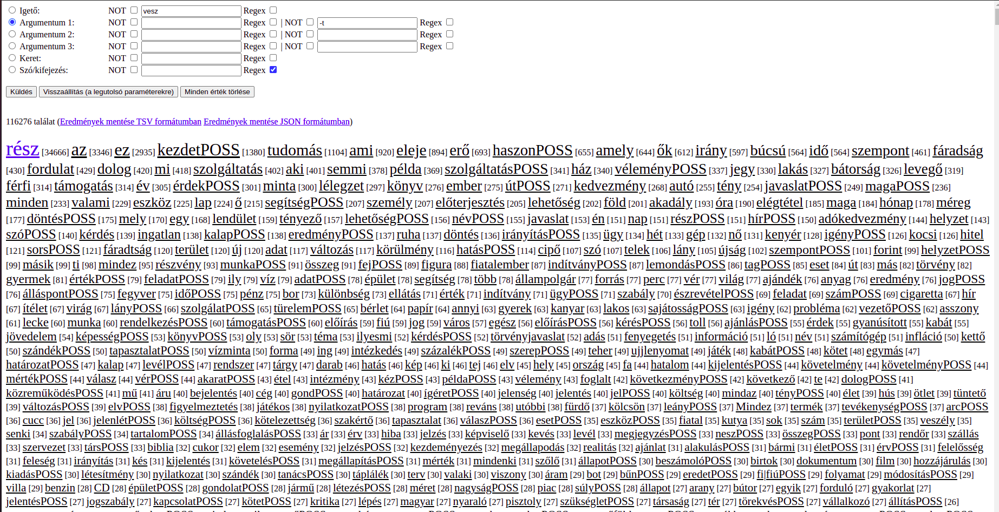

A kékkel jelölt linkek azokra a találatokra mutatnak, amelyek az aktuálisan megjelenített oldalon találhatók,
a feketével jelöltek pedig a további oldalakon kifejtett találatokat jelölik.

#### 3. Argumentumkeretek lekérdezése

A felület segítéségével lehetőségünk van az egyes argumentumokon vagy azok egyidejű jelenlétén túl
akár teljes kereteket is specifikálni. De nem csak arra van lehetőségünk, hogy az egyes igetövek gyakori kereteit 
kérdezzük le, hanem például további argumentumeset-megszorítások használatával kötelező argumentumok mellet
opcionálisan megjelenő egyéb esetet is vizsgálhatunk.

##### 3.1. Keret lekérdezése igetőhöz

Ha arra vagyunk kíváncsiak, hogy az általunk vizsgált igető milyen általánosabb argumentumszerkezetekkel milyen 
gyakoriságban fordul elő, az igető megadása után a **Keret** opció előtti **rádiógomb**ot kell kiválasztanunk.

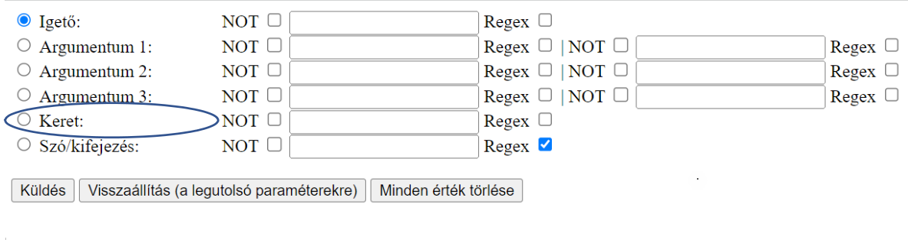

A **Keret** meghatározása nélkül az eredmény az igető összes előfordulása lesz
a keretek szerint csoportosítva, miként a *megsegít* tőnél az alábbi ábra mutatja.

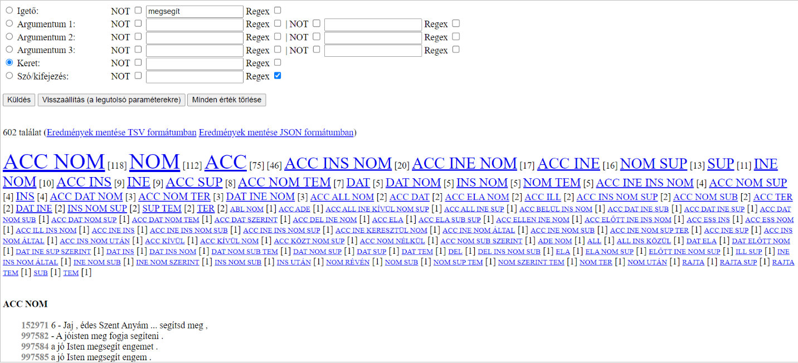

További kötelező argumentumok megadásával szűkíthető a találati lista a kötelező argumentum mellett
csak ritkábban megjelenő eseteket tartalmazó keretekre.
Ezáltal – mindkét irányt megvizsgálva – a kötelező és opcionális vonzatok vizsgálhatóak.

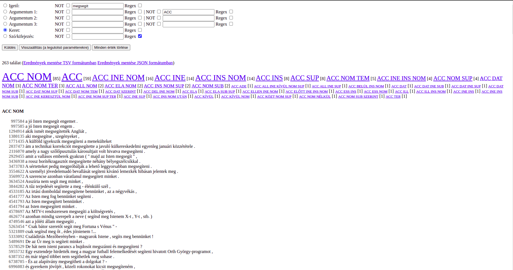

##### 3.2. Lekérdezés meghatározott kerettel

Előfordulhat, hogy az adott igető kapcsán bennünket csak egy specifikus keret előfordulási adatai érdekelnek. 
Ekkor az igető megadása mellett a keretet is meg kell határoznunk
(az esetek megadásához segítségért lásd a [függelékbeli táblázatot](#függelék)), 
majd a **Keret** opció előtti **rádiógomb**ot aktiválva küldhetjük el a lekérdezésünket.

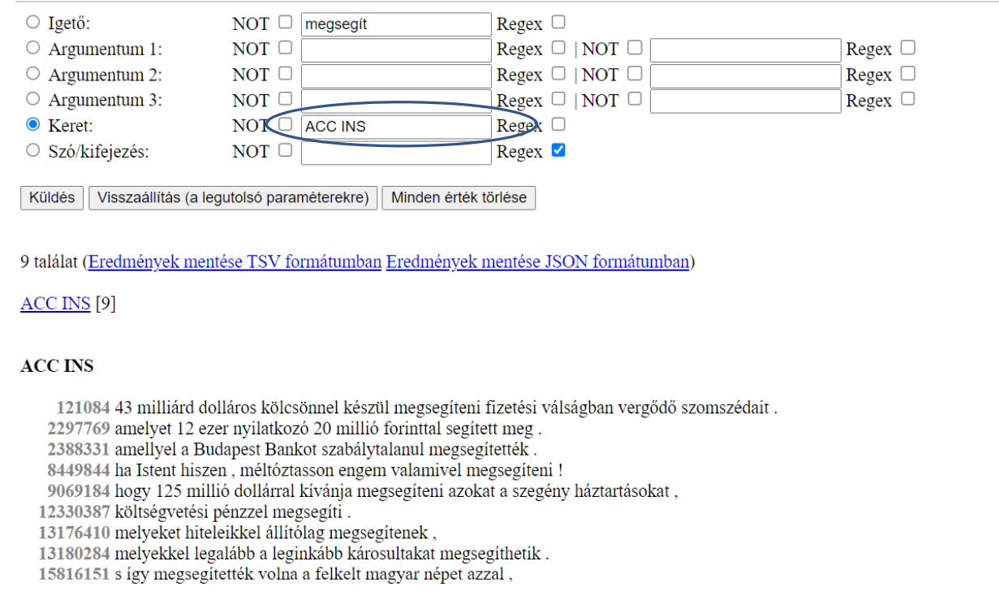

Ha a **Keret** mezőben nem megfelelő az esetek sorrendje, a rendszer hibát fog adni.

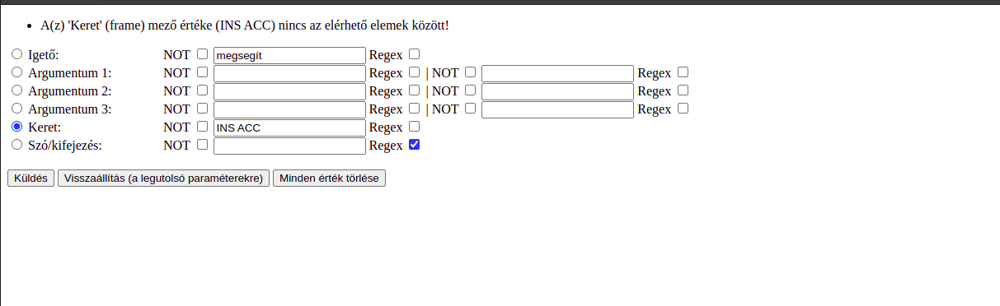

Ekkor érdemes lehet megkeresni a rendszer által ismert sorrendet úgy,
hogy külön argumentumokként adjuk meg a keresett eseteket, és utána a helyes esetsorrend megadásával
keret szerint rendezünk.

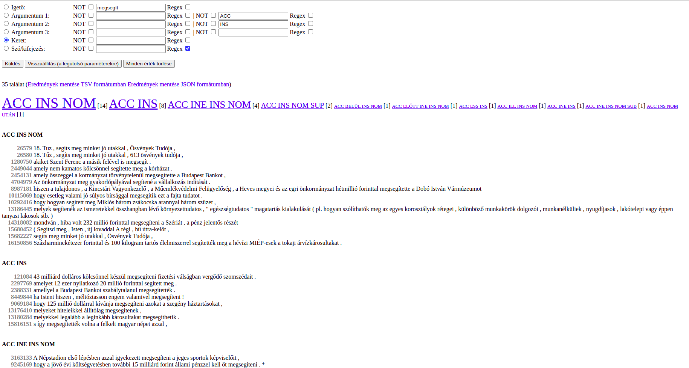

(A fenti ábrán a második találat a keresett keret rendszer által ismert alakja.)

#### 3.3. Keret megadása igető nélkül

Hasonló módon határozhatjuk meg az argumentumkeretre illeszkedő igetöveket is: üresen hagyjuk az **igető mezőjét**,
de a **rádiógomb**okkal kiválasztva azt mint a lekérdezés rendezési szempontját.
Például rákereshetünk minden olyan igére, amely mellett egy *tárgyeset*ben (-*Vt*), egy *ablativus*ban (-*tÓl*),
egy *adessivus*ban (-*nÁl*) álló bővítmény van, illetve egy további argumentum az *alatt* névutóval,
tehát *ABL ACC ADE ALATT* kódú keretben fordul elő.

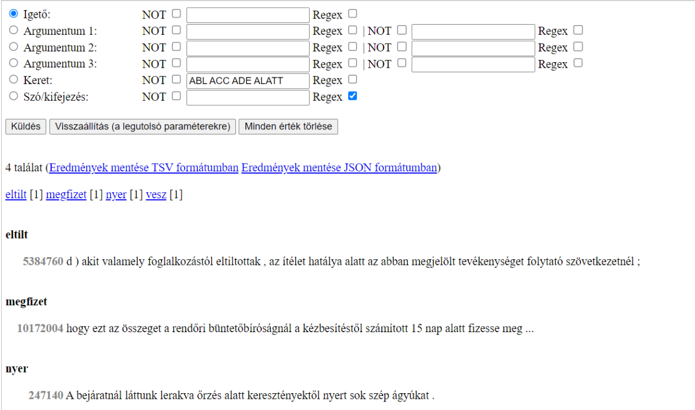

###  A keresési feltételek finomhangolásának lehetőségei

A továbbiakban olyan beállítási lehetőségekre térünk ki röviden, amelyek minden eddig bemutatott lekérdezésnél 
alkalmazhatók, az eredmények finomítása céljából.

#### 1. A Regex funkció

A **Regex** funkció bekapcsolásával (a **Regex** melletti jelölőnégyzet bepipálásával) engedélyezzük a reguláris kifejezések 
használatát az adott szövegmezőben (a nem szöveges, például számot tartalmazó mezőkén ez az opció nem aktív).
Ha nem konkrét lemmákra vagyunk kíváncsiak, hanem egy adott tulajdonsággal bíró lemmák csoportjának a kiszűrése a cél,
akkor érdemes a **Regex** funkciót használnunk. Például ha azt keressük, hogy a -*ság* / -*ség* képzővel bíró szavak
akkuzatívuszi alakban milyen mintázatokban jelennek meg az *ad* igetővel,
akkor érdemes reguláris kifejezést használnunk (`(ság|ség)$`).

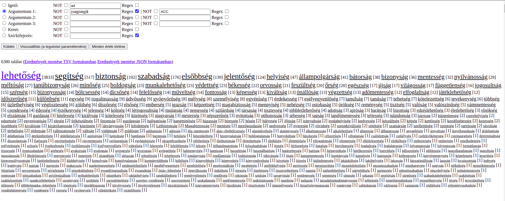

Fontos, hogy a **Regex** funkció mindig csak annál a megadott beviteli mezőnél 
érvényesül, ahol azt bepipáltuk. Természetesen egyszerre többet is aktiválhatunk.

#### 2. A NOT funkció

A **NOT** funkció bekapcsolásával tudunk negatívszűréseket végezni, tehát amikor a **NOT** aktív a kezelőfelületen 
(a mellette lévő jelölőnégyzet bepipálásával aktiválhatjuk), akkor minden olyan példát listázni fog nekünk a kereső, 
ami nem illeszkedik a beírt értékre. Fontos, hogy a **NOT** funkció mindig csak annál a beviteli mezőnél 
érvényesül, ahol azt bepipáltuk. Természetesen egyszerre több feltételnél is aktiválhatjuk.

Az alábbi két képen láthatjuk, hogy a megadott negatív szűrés az -*An* mozzanatos 
igeképzővel előforduló igetövek környezeteiben szűri ki a prototipikusan absztrakt jelentéssel bíró képzett névszói 
alakok nominatívuszi eseteit. Az első képen a megszorítás nélküli lekérdezést látjuk, a másodikon pedig a negatív
szűrés után kapott találatokat.

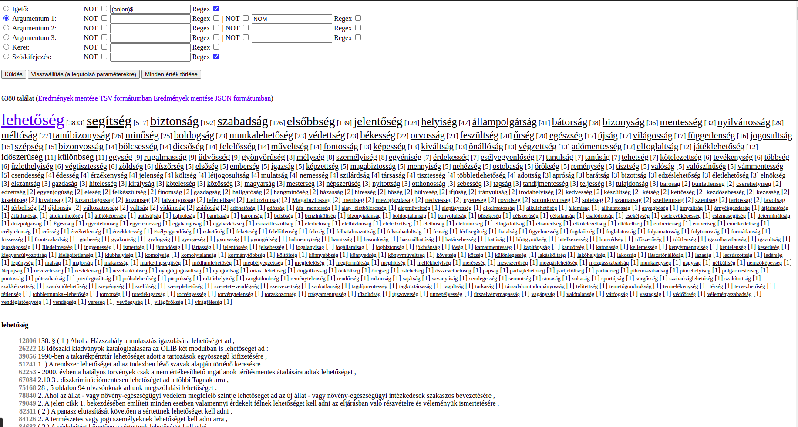

A negatív szűrés során olyan a névszóképzőket adtunk meg reguláris kifejezésbe ágyazva, 
melyek valamilyen elvont cselekvés, történés kifejezésére szolgálnak: `(aj|ej|ság|ség|at|et|hatnék|hetnék|mány|mény)$`.

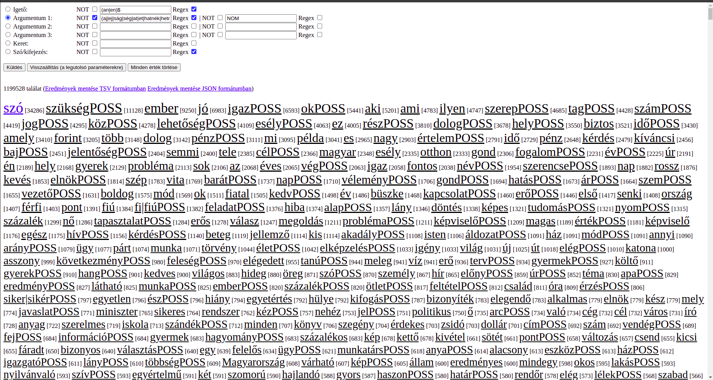

Így többnyire ki lehet szűrni az absztraktumokat a névszóképzőkön alapuló negatív szűrésen
keresztül, szükség esetén finomhangolva a keresési feltételeket.
Azonban ennek a módszernek vannak korlátai a szemantikai célú lekérdezések esetében.

#### 3. A Szó/kifejezés funkció

A **Szó/kifejezés** funkcióval a korpuszból vett példamondatokban való keresés válik elérhetővé a felhasználó számára. 
A **Regex** funkció azért van alapértelmezetten bekapcsolva ennél a szövegmezőnél,
mert így a mondatok bármely pozíciójában előforduló lexémára és azok részeire is illeszkedhet a keresésünk,
ellenkező esetben csak olyan találatokat listázna ki, amelyeknél a példmondat egy az egyben megfeleltethető
a beírt kifejezésnek.

### Függelék

Az adatbázisban található grammatikai elemek és leírásuk:

| Grammatikai elem | Alias                     | Kifejtés                                   | Példák                            |
|------------------|---------------------------|--------------------------------------------|-----------------------------------|
| ABL              | -tÓl                      | Ablativus, -tÓl                            | ház*tól*                          |
| ACC              | -t, tárgy, tárgyeset      | Accusativus, -Vt                           | körté*t*                          |
| ADE              | -nÁl                      | Adessivus, -nÁl                            | folyó*nál*                        |
| ALL              | -hOz                      | Allativus, -hOz                            | lépcső*höz*                       |
| ALÁ              | ALÁ                       | Névutós határozói  viszony            | asztal *alá*                      |
| ALATT            | ALATT                     | Névutós határozói  viszony            | asztal *alatt*                    |
| ALÓL             | ALÓL                      | Névutós határozói  viszony            | asztal *alól*                     |
| ALUL             | ALUL                      | Névutós határozói  viszony            | értéken *alul*                    |
| ALUL-FELÜL       | ALUL-FELÜL                | Névutós határozói  viszony            | *alul-felül* összevarrta          |
| ÁLTAL            | ÁLTAL                     | Névutós határozói  viszony            | ember *által*                     |
| BELÜL            | BELÜL                     | Névutós határozói  viszony            | órán *belül*                      |
| BELŐL            | BELŐL                     | Névutós határozói  viszony            | sütemény lesz *belőle*            |
| BÉVÜL            | BÉVÜL                     | Névutós határozói  viszony            | *bévül* van a házban              |
| CAU              | -ért                      | Causalis, -ért                             | tej*ért*                          |
| DACÁRA           | DACÁRA                    | Névutós határozói  viszony            | hírek *dacára*                    |
| DAT              | -nAk, részes, részeseset  | Dativus, -nAk                              | macská*nak*                       |
| DEL              | -rÓl,                     | Delativus, -rÓl                            | asztal*ról*                       |
| EGYÜTT           | EGYÜTT                    | Névutós határozói  viszony            | barátokkal *együtt*               |
| ELA              | -bÓl                      | Elativus, -bÓl                             | szekrény*ből*                     |
| ELIBE            | ELIBE                     | Névutós határozói  viszony            | *elibe* fut                       |
| ELIBÉ            | ELIBÉ                     | Névutós határozói  viszony            | *elibé* áll                       |
| ELLEN            | ELLEN                     | Névutós határozói  viszony            | rosszindulat *ellen*              |
| ELLENÉRE         | ELLENÉRE                  | Névutós határozói  viszony            | hír *ellenére*                    |
| ELÉ              | ELÉ                       | Névutós határozói  viszony            | ház *elé*                         |
| ELÉBE            | ELÉBE                     | Névutós határozói  viszony            | örömnek néz *elébe*               |
| ELŐL             | ELŐL                      | Névutós határozói  viszony            | valóság *elől*                    |
| ELŐTT            | ELŐTT                     | Névutós határozói  viszony            | szobor *előtt*                    |
| EZ-ELŐTT         | EZ-ELŐTT                  | Instrumentalis + névutó, -vAl + ezelőtt    | esztendővel ezelőtt               |
| ESS              | -Ul                       | Essivus, -Ul                               | bal*ul*                           |
| FAC              | -vÁ                       | Factivus / Translativus, -vÁ               | piros*sá*                         |
| FELE             | FELE                      | Névutós határozói  viszony            | ház *fele*                        |
| FELE-FELE        | FELE-FELE                 | Névutós határozói  viszony            | *fele-fele* arányban              |
| FELIBE           | FELIBE                    | Névutós határozói  viszony            | *felibe* tör                      |
| FELETT           | FELETT                    | Névutós határozói  viszony            | felszín *felett*                  |
| FELÜL            | FELÜL                     | Névutós határozói  viszony            | ezen *felül*                      |
| FELÜLRE          | FELÜLRE                   | Névutós határozói  viszony            | *felülre* kerül                   |
| FELÜLRŐL         | FELÜLRŐL                  | Névutós határozói  viszony            | *felülről* nézi                   |
| FELÉ             | FELÉ                      | Névutós határozói  viszony            | erdő *felé*                       |
| FELŐL            | FELŐL                     | Névutós határozói  viszony            | ház *felől*                       |
| FOGVA            | FOGVA                     | Névutós határozói  viszony            | holnaptól *fogva*                 |
| FOGVÁST          | FOGVÁST                   | Névutós határozói  viszony            | attól *fogvást*                   |
| FOK              | FOK                       | határozók fokozott alakjai                 | *gyakrabban*, *gyorsabban*        |
| FOLYTÁN          | FOLYTÁN                   | Névutós határozói  viszony            | véletlen *folytán*                |
| FOR              | -ként                     | Formailis, -ként                           | gyerek*ként*                      |
| FÖL-ALÁ          | FÖL-ALÁ                   | Névutós határozói  viszony            | *föl-alá* járkál                  |
| FÖLÉ             | FÖLÉ                      | Névutós határozói  viszony            | asztal *fölé*                     |
| FÖLÉBE           | FÖLÉBE                    | Névutós határozói  viszony            | *fölébe* kerekedik                |
| FÖLÜL            | FÖLÜL                     | Névutós határozói  viszony            | *fejük* fölül                     |
| FÖLÜLRŐL         | FÖLÜLRŐL                  | Névutós határozói  viszony            | *fölülről* ereszkedik le          |
| FÖLÖTT           | FÖLÖTT                    | Névutós határozói  viszony            | emelett *fölött*                  |
| GYANÁNT          | GYANÁNT                   | Névutós határozói  viszony            | róka *gyanánt*                    |
| HELYETT          | HELYETT                   | Névutós határozói  viszony            | olló *helyett*                    |
| HIN              | HIN                       | Határozói igenév                           | *illegve*, *futva*                |
| HOSSZAT          | HOSSZAT                   | Névutós határozói  viszony            | óra *hosszat*                     |
| ILL              | -bA                       | Illativus, -bA                             | ház*ba*                           |
| INE              | -bAn                      | INESSIVUS, -bAn                            | ház*ban*                          |
| INF              | INF                       | Infinitivus, főnévi igenév                 | *futni*, *aludni*                 |
| INS              | -vAl                      | Instrumentalis, -vAl                       | táská*val*                        |
| IRÁNT            | IRÁNT                     | Névutós határozói  viszony            | könyv *iránt*                     |
| KERESZTÜL        | KERESZTÜL                 | Névutós határozói  viszony            | ösvényen *keresztül*              |
| KÉPEST           | KÉPEST                    | Névutós határozói  viszony            | mához *képest*                    |
| KÍVÜL            | KÍVÜL                     | Névutós határozói  viszony            | kerítésen *kívül*                 |
| KÍVÜL-BELÜL      | KÍVÜL-BELÜL               | Névutós határozói  viszony            | *kívül-belül* felújították        |
| KÖRÉ             | KÖRÉ                      | Névutós határozói  viszony            | kastély *köré*                    |
| KÖRÜL            | KÖRÜL                     | Névutós határozói  viszony            | oszlop *körül*                    |
| KÖRÜLÖTT         | KÖRÜLÖTT                  | Névutós határozói  viszony            | békesség van *körülötte*          |
| KÖRÜLÖTTI        | KÖRÜLÖTTI                 | Névutós határozói  viszony            | döntés *körülötti* bizonytalanság |
| KÖRÖTT           | KÖRÖTT                    | Névutós határozói  viszony            | kert *körött*                     |
| KÖVETKEZTÉBEN    | KÖVETKEZTÉBEN             | Névutós határozói  viszony            | az eset *következtében*           |
| KÖZEL            | KÖZEL                     | Névutós határozói  viszony            | *közel* kerül                     |
| KÖZELÉBEN        | KÖZELÉBEN                 | Névutós határozói  viszony            | bolt *közelében*                  |
| KÖZELRE          | KÖZELRE                   | Névutós határozói  viszony            | *közelre* tette                   |
| KÖZELRŐL         | KÖZELRŐL                  | Névutós határozói  viszony            | *közelről* nézte                  |
| KÖZÉ             | KÖZÉ                      | Névutós határozói  viszony            | kevesek *közé*                    |
| KÖZIBE           | KÖZIBE                    | Névutós határozói  viszony            | szeme *közibe*                    |
| KÖZÖTT           | KÖZÖTT                    | Névutós határozói  viszony            | fák *között*                      |
| KÖZÜL            | KÖZÜL                     | Névutós határozói  viszony            | versenyzők *közül*                |
| KÖZT             | KÖZT                      | Névutós határozói  viszony            | *köztük* sokan                    |
| ME3              | ME3                       | Múlt idejű igealak, E/3.                   | *nagyothallott*, *csencselt*      |
| MELLÉ            | MELLÉ                     | Névutós határozói  viszony            | szobor *mellé*                    |
| MELLETT          | MELLETT                   | Névutós határozói  viszony            | ház *mellett*                     |
| MELLŐL           | MELLŐL                    | Névutós határozói  viszony            | íróasztal *mellől*                |
| MENTÉN           | MENTÉN                    | Névutós határozói  viszony            | folyó *mentén*                    |
| MIALATT          | MIALATT                   | Határozói viszony                          | *mialatt* aludt                   |
| MIATT            | MIATT                     | Névutós határozói  viszony            | macska *miatt*                    |
| MIRAJTUNK        | MIRAJTUNK                 | Névutós határozói  viszony            | *mirajtunk* a sor                 |
| MÖGÉ             | MÖGÉ                      | Névutós határozói  viszony            | fa *mögé*                         |
| MÖGÜL            | MÖGÜL                     | Névutós határozói  viszony            | háta *mögül*                      |
| MÖGÖTT           | MÖGÖTT                    | Névutós határozói  viszony            | vonat *mögött*                    |
| MÚLVA            | MÚLVA                     | Névutós határozói  viszony            | egy hét *múlva*                   |
| MÚLVÁN           | MÚLVÁN                    | Névutós határozói  viszony            | egy óra *múlván*                  |
| MÚLTÁN           | MÚLTÁN                    | Névutós határozói  viszony            | évek *múltán*                     |
| NOM              | alany, alanyeset          | Nominativus, alanyeset                     | *ház*                             |
| NÉLKÜL           | NÉLKÜL                    | Névutós határozói  viszony            | esernyő *nélkül*                  |
| ÓTA              | ÓTA                       | Névutós határozói  viszony            | tavaly *óta*                      |
| PE2              | PE2                       | Jelen idejű igealak, E/2.                  | *moziztass*                       |
| PE3              | PE3                       | Jelen idejű igealak, E/3.                  | *moziztasson*                     |
| RAJTA            | RAJTA                     | Határozói viszony                          | *rajta* ül                        |
| RÉSZÉRE          | RÉSZÉRE                   | Névutós határozói  viszony            | gyerek *részére*                  |
| RÉVÉN            | RÉVÉN                     | Névutós határozói  viszony            | munka *révén*                     |
| SOC              | -stUl                     | Sociativus, -stUl                          | baráto*stul*                      |
| SUB              | -rA                       | Sublativus, -rA                            | asztal*ra*                        |
| SUP              | -On                       | Superessivus, -On                          | asztal*on*                        |
| SZEMBEN          | SZEMBEN                   | Névutós határozói  viszony            | vele *szemben*                    |
| SZERINT          | SZERINT                   | Névutós határozói  viszony            | hír *szerint*                     |
| SZÁMÁRA          | SZÁMÁRA                   | Névutós határozói  viszony            | ő *számára*                       |
| TEM              | -kor                      | Temporalis, -kor                           | öt*kor*                           |
| TER              | -ig                       | Terminativus, -ig                          | kerítés*ig*                       |
| TT3              | TT3                       | Mediális igeképzővel képzett igealak, E/3. | *ellehetetlenedik*                |
| TÚL              | TÚL                       | Névutós határozói  viszony            | folyón *túl*                      |
| UTÁN             | UTÁN                      | Névutós határozói  viszony            | ebéd *után*                       |
| ÚTJÁN            | ÚTJÁN                     | Névutós határozói  viszony            | tárgyalás *útján*                 |
| VÉGETT           | VÉGETT                    | Névutós határozói  viszony            | döntés *végett*                   |
